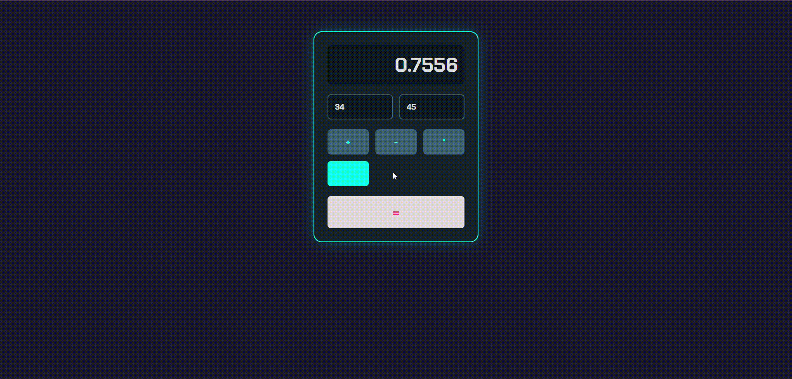

# Sigma Web Development - Exercise 9: Interactive "Faulty" Calculator

This repository contains my solution for Exercise 9 of the Sigma Web Development course. The project is a fully interactive calculator built with HTML, CSS, and JavaScript. It features a unique "faulty" mechanic and a matching cyberpunk/glitch visual theme.

---

## 🚀 Project Features

This project demonstrates the integration of JavaScript logic with a styled HTML front-end.

- **Interactive User Interface:** Users can input numbers and select operations using a clean, modern UI.
- **JavaScript Logic:** The core calculations are handled by JavaScript, including parsing user input and updating the display.
- **"Faulty" Mechanic:** There is a 10% chance that the calculator will perform the wrong operation, demonstrating conditional logic (`if/else`) and random number generation (`Math.random()`).
- **Visual Glitch Effect:** When a faulty calculation occurs, the result display is animated with a complex CSS "glitch" effect, providing clear and stylish feedback to the user.
- **Modern Theming:** The calculator is styled with a "cyberpunk" theme, using CSS variables, custom fonts, and box-shadows to create an immersive look.

## 🛠️ Tech Stack

- **HTML5:** For the structure of the calculator.
- **CSS3:** For all styling, layout (Flexbox/Grid), and the advanced glitch animation (`@keyframes`).
- **JavaScript:** For all user interaction, DOM manipulation, and calculation logic.

## 🙏 Acknowledgements

- This project is part of the **Sigma Web Development Course** by **CodeWithHarry**.
